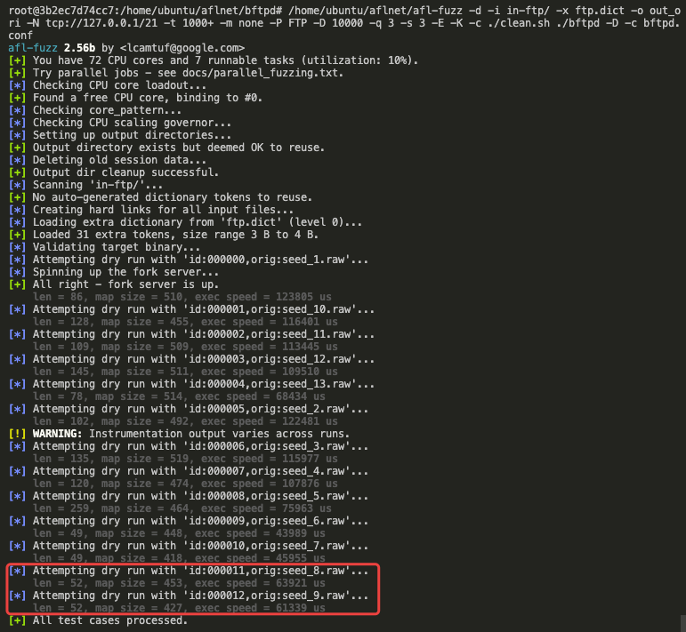
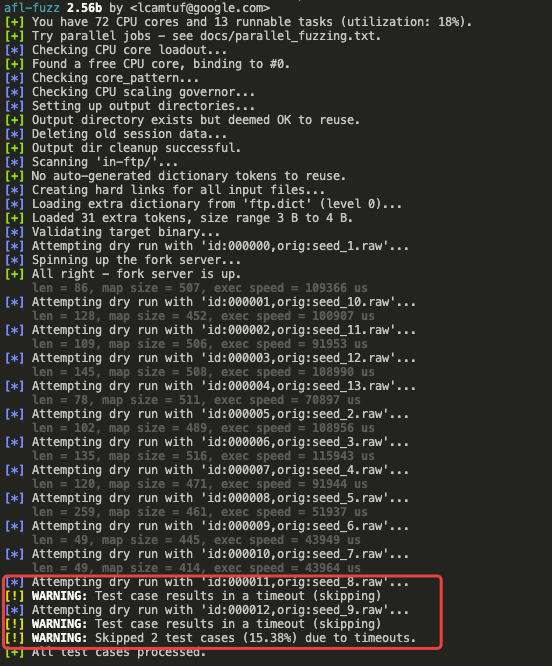

# Signal-Based AFLNet (AFLNet_S)

## Static Analysis

- 在PreAnalysis/SVAnalyzer目录下，首先修改`Makefile.inc`中的`LLVM_BUILD`的路径为本机的LLVM路径，然后依次执行
    ```
    mkdir build && cd build
    cmake ../
    make -j32
    ```
    完成静态分析器的编译
- 环境变量
    ```
    cd aflnet
    export AFLNET=$(pwd) \
    export STATIC=$AFLNET/PreAnalysis/SVAnalyzer \
    export CLANG=/home/ubuntu/llvm-9.0.0.src/build/bin/clang # emit script would use \
    export CLANGXX=/home/ubuntu/llvm-9.0.0.src/build/bin/clang++ \
    export AFL_PATH=$AFLNET # useful for compiling afl-clang-fast \
    export AFL_CC=$CLANG # the real path of afl-clang-fast wrapper \
    export AFL_CXX=$CLANGXX \
    export PATH=$PATH:$STATIC:$STATIC/build/bin:$AFLNET


    new
    export NSFUZZ=$(pwd) \
    export STATIC=$NSFUZZ/PreAnalysis/SVAnalyzer \
    export CLANG=/home/ubuntu/clang-9.0.0/bin/clang # emit script would use \
    export CLANGXX=/home/ubuntu/clang-9.0.0/bin/clang++ \
    export AFL_PATH=$NSFUZZ # useful for compiling afl-clang-fast \
    export AFL_CC=$CLANG # the real path of afl-clang-fast wrapper \
    export AFL_CXX=$CLANGXX \
    export PATH=$PATH:$STATIC:$STATIC/build/bin:$NSFUZZ
    ```
- 静态分析
    - bftpd
    ```
    CC="clang-emit-bc-new.sh" make
    find . -name "*.llbc" > bitcode.list
    sudo su
    python3 /home/ubuntu/aflnet/PreAnalysis/SVAnalyzer/get_backtrace.py --sut_path ./bftpd --sut_option "-D -c basic.conf" --port 2200
    SVAnalyzer @bitcode.list -i input.btrace -o static_out_test_0924 -s sync_point_0924 --dump-call-map > output_test_0924 2>&1
    ```
    - pure-ftpd
    ```
    ./configure --without-privsep -without-capabilities -without-inetd CC=clang-emit-bc.sh 
    make V=1
    find . -name "*.llbc" > bitcode.list
    sudo su
    python3 /home/ubuntu/aflnet/PreAnalysis/SVAnalyzer/get_backtrace.py --sut_path src/pure-ftpd --sut_option "-S 2200" --port 2200
    SVAnalyzer @bitcode.list -i input.btrace -o static_out_test_0924 -s sync_point_0924 --dump-call-map > output_test_0924 2>&1
    ```
    - proftpd
    ```
    ./configure --enable-devel=coredump:nodaemon:nofork
    make V=1 CC=clang-emit-bc-new.sh
    find . -name "*.llbc" > bitcode.list
    sudo su
    python3 /home/ubuntu/aflnet/PreAnalysis/SVAnalyzer/get_backtrace.py --sut_path ./proftpd --sut_option "-n -d 5 -c /home/ubuntu/proftpd-1.3.6b/basic.conf" --port 2200
    SVAnalyzer @bitcode.list -i input.btrace -o static_out_test_0924 -s sync_point_0924 --dump-call-map > output_test_0924 2>&1
    ```
    - dnsmasq
    ```
    patch && 更新配置文件
    CC="clang-emit-bc-new.sh" make
    find . -name "*.llbc" > bitcode.list
    python3 /home/ubuntu/aflnet/PreAnalysis/SVAnalyzer/get_backtrace.py --sut_path src/dnsmasq --port 5353 --type udp
    SVAnalyzer @bitcode.list -i input.btrace -o static_out_test_1014 -s sync_point_1014 --dump-call-map > output_test_0924 2>&1
    ```
    - tinydlts
    ```
    cd tests
    CC="clang-emit-bc-new.sh" make
    /home/ubuntu/llvm-9.0.0.src/build/bin/clang -O0 -emit-llvm -g -c -DLOG_LEVEL_DTLS=LOG_LEVEL_INFO -I. -I.. -I../posix dtls-server.c  -o dtls-server.llbc
    cd ..
    find . -name "*.llbc" > bitcode.list
    python3 /home/ubuntu/aflnet/PreAnalysis/SVAnalyzer/get_backtrace.py --sut_path tests/dtls-server --port 20220 --type udp
    SVAnalyzer @bitcode.list -i input.btrace -o static_out_test_1025 -s sync_point_1025 --dump-call-map > output_test_1025 2>&1
    ```
    - lightftp
    ```
    cd Source/Release
    CC="clang-emit-bc-new.sh" make
    find . -name "*.llbc" > bitcode.list
    python3 /home/ubuntu/aflnet/PreAnalysis/SVAnalyzer/get_backtrace.py --sut_path ./fftp --sut_option "fftp.conf 2200" --port 2200
    // 目前只定位到了access这个变量
    SVAnalyzer @bitcode.list -i input.btrace -o static_out -s sync_point --dump-call-map > output_test 2>&1
    ```
    - kamailio
    ```
    CC="clang-emit-bc-new.sh" make MEMPKG=sys cfg //进入src/config.mak patch掉clang-emit-bc-new.sh后的9.0
    // 可以编译出kamailio，但运行会报错，所以可以再用gcc make一遍
    make all
    //或者用clang-emit-bc.sh编译，不用修改config.mak
    find . -name "*.llbc" > bitcode.list
    python3 /home/ubuntu/aflnet/PreAnalysis/SVAnalyzer/get_backtrace.py --sut_path src/kamailio --sut_option "-f /home/ubuntu/probenchmark/SIP/kamailio-basic.cfg -L src/modules -Y runtime_dir -n 1 -D -E" --port 5060 --type udp
    //有一些行号宏会导致误报（比如ksr_logdata这个变量）
    SVAnalyzer @bitcode.list -i input.btrace -o static_out -s sync_point --dump-call-map > output_test 2>&1
    ```
    - exim
    ```
    cd src //添加对fork的注释和static handle_smtp_call的patch
    make clean all && make CC="clang-emit-bc-new.sh" clean exim
    find . -name "*.llbc" > bitcode.list
    python3 /home/ubuntu/aflnet/PreAnalysis/SVAnalyzer/get_backtrace.py --sut_path build-Linux-x86_64/exim --sut_option "-bd -d -oX 25 -oP /var/lock/exim.pid" --port 25
    SVAnalyzer @bitcode.list -i input.btrace -o static_out -s sync_point --dump-call-map > output_test 2>&1
    //需要删除var.message_id这个SV，否则编译插桩时clang会报错
    ```
    - sshd
    ```
    autoreconf
    ./configure CFLAGS="-g -O3" --prefix=$PWD/install --with-privsep-path=$PWD/var-empty --with-sandbox=no --with-privsep-user=ubuntu
    make V=1 CC="clang-emit-bc-new.sh"
    make install
    find . -name "*.llbc" > bitcode.list
    python3 /home/ubuntu/aflnet/PreAnalysis/SVAnalyzer/get_backtrace.py --sut_path ./sshd --sut_option "-d -e -p 2200 -r -f sshd_config" --port 2200
    SVAnalyzer @bitcode.list -i input.btrace -o static_out -s sync_point --dump-call-map > output_test 2>&1
    ```
- 插桩
    - 编译afl
    ```
    cd aflnet && make
    cd llvm_mode && LLVM_CONFIG=/home/ubuntu/llvm-9.0.0.src/build/bin/llvm-config CC=/home/ubuntu/llvm-9.0.0.src/build/bin/clang CXX=/home/ubuntu/llvm-9.0.0.src/build/bin/clang++ make
    ```
    - bftpd
    ```
    make clean
    pathch makefile
    CC=afl-clang-fast NSFUZZ_TRACE_STATE=1 ANALYZER_SVFILE_PATH="/home/ubuntu/bftpd/static_out" ANALYZER_SYNCFILE_PATH="/home/ubuntu/bftpd/sync_out" make
    ```
    - pure-ftpd
    ```
    make clean
    ./configure --without-privsep -without-capabilities -without-inetd CC=afl-clang-fast
    make NSFUZZ_TRACE_STATE=1 ANALYZER_SVFILE_PATH="/home/ubuntu/probenchmark/FTP/pure-ftpd/static_out" ANALYZER_SYNCFILE_PATH="/home/ubuntu/probenchmark/FTP/pure-ftpd/sync_point"
    ```
    - proftpd
    ```
    make clean
    ./configure --enable-devel=coredump:nodaemon:nofork CC=afl-clang-fast
    make NSFUZZ_TRACE_STATE=1 AFL_DONT_OPTIMIZE=1 ANALYZER_SVFILE_PATH="/home/ubuntu/probenchmark/FTP/proftpd/static_out_t" ANALYZER_SYNCFILE_PATH="/home/ubuntu/probenchmark/FTP/proftpd/sync_point"
    ```
    - dnsmasq
    ```
    make clean
    CC=afl-clang-fast make NSFUZZ_TRACE_STATE=1 ANALYZER_SVFILE_PATH="/home/ubuntu/probenchmark/DNS/dnsmasq/static_out_t" ANALYZER_SYNCFILE_PATH="/home/ubuntu/probenchmark/DNS/dnsmasq/sync_point_t"
    ```
    - tinydtls
    ```
    cd tests
    make clean
    CC=afl-clang-fast make NSFUZZ_TRACE_STATE=1 ANALYZER_SVFILE_PATH="/home/ubuntu/probenchmark/DTLS/tinydtls/static_out_test" ANALYZER_SYNCFILE_PATH="/home/ubuntu/probenchmark/DTLS/tinydtls/sync_point_test"
    ```
    - lightftp
    ```
    make clean
    CC=afl-clang-fast make NSFUZZ_TRACE_STATE=1 ANALYZER_SVFILE_PATH="/home/ubuntu/probenchmark/FTP/lightftp/Source/Release/static_out" ANALYZER_SYNCFILE_PATH="/home/ubuntu/probenchmark/FTP/lightftp/Source/Release/sync_point"
    ```
    - kamailio
    ```
    make clean
    CC=afl-clang-fast make MEMPKG=sys cfg
    //同步点使用annotation，需要结合手工patch过滤端口
    make all NSFUZZ_TRACE_STATE=1 ANALYZER_SVFILE_PATH="/home/ubuntu/probenchmark/SIP/kamailio/static_out" MANNUAL_SYNC=1
    ```
    - exim
    ```
    make clean
    // /home/ubuntu/probenchmark/SMTP/exim/src/src/smtp_in.c L426 & /home/ubuntu/probenchmark/SMTP/exim/src/build-Linux-x86_64/daemon.c L476 使用annotation插桩同步点 (静态分析只能识别出第二个)
    make CC=afl-clang-fast clean exim NSFUZZ_TRACE_STATE=1 ANALYZER_SVFILE_PATH="/home/ubuntu/probenchmark/SMTP/exim/src/static_out_test" MANNUAL_SYNC=1
    ```
    - sshd
    ```
    make clean
    // /home/ubuntu/probenchmark/SSH/openssh/sshd.c L2019 & /home/ubuntu/probenchmark/SSH/openssh/dispatch.c L101 使用annotation插桩同步点(静态分析只能识别出第二个)
    ./configure CC="afl-clang-fast" --prefix=$PWD/install --with-privsep-path=$PWD/var-empty --with-sandbox=no --with-privsep-user=ubuntu
    make NSFUZZ_TRACE_STATE=1 ANALYZER_SVFILE_PATH="/home/ubuntu/probenchmark/SSH/openssh/static_out" MANNUAL_SYNC=1
    make install
    ```
- fuzzing
    - bftpd
    ```
    sudo su
    NET_FORKSERV=1 /home/ubuntu/aflnet/afl-fuzz -d -i in-ftp/ -x ftp.dict -o out_20211004 -N tcp://127.0.0.1/2200 -t 1000+ -m none -P FTP -D 10000 -q 3 -s 3 -E -K -R -c ./clean.sh ./bftpd -D -c basic.conf
    ```
    - pure-ftpd
    ```
    sudo su
    AFLNET_DEBUG=1 NET_FORKSERV=1 /home/ubuntu/aflnet/afl-fuzz -d -i in-ftp/ -x ftp.dict -o out_20211021 -N tcp://127.0.0.1/2200 -t 1000+ -m none -P FTP -D 10000 -q 3 -s 3 -E -K -R -c ./clean.sh src/pure-ftpd -S 2200
    ```
    - proftpd
    ```
    sudo su
    NET_FORKSERV=1 /home/ubuntu/aflnet/afl-fuzz -d -i in-ftp/ -x ftp.dict -o out_20211004 -N tcp://127.0.0.1/2200 -t 1000+ -m none -P FTP -D 10000 -q 3 -s 3 -E -K -R -c ./clean.sh ./proftpd -n -c /home/ubuntu/proftpd-1.3.6b/basic.conf -X
    ```
    - dnsmasq
    ```
    AFLNET_DEBUG=1 NET_FORKSERV=1 /home/ubuntu/aflnet/afl-fuzz -d -i in-dns/ -o out_20211021 -N udp://127.0.0.1/5353 -t 1000+ -m none -w 10000 -P DNS -D 10000 -q 3 -s 3 -E -K src/dnsmasq
    ```
    - tinydtls
    ```
    AFLNET_DEBUG=1 NET_FORKSERV=1 /home/ubuntu/aflnet/afl-fuzz -d -i in-dtls/ -o out_20211025 -N udp://127.0.0.1/20220 -t 1000+ -m none -P DTLS12 -D 10000 -q 3 -s 3 -E -K -W 30 tests/dtls-server
    ```
    - lightftp
    ```
    // 在fuzzer commit bdb343669bd7fe48090fdee4bde7e7f1be487e09 才有用, stat check在该目标下会timeout
    AFLNET_DEBUG=1 NET_FORKSERV=1 /home/ubuntu/aflnet/afl-fuzz -d -i in-ftp/ -x ftp.dict -o test -N tcp://127.0.0.1/2200 -t 1000+ -m none -P FTP -D 10000 -q 3 -s 3 -E -R -K -c ./ftpclean.sh ./fftp fftp.conf 2200
    ```
    - kamailio
    ```
    // -l似乎不再必要
    AFLNET_DEBUG=1 NET_FORKSERV=1 /home/ubuntu/aflnet/afl-fuzz -d -i ../in-sip -o out -N udp://127.0.0.1/5060 -m none -t 1000+ -P SIP -l 5061 -D 10000 -q 3 -s 3 -E -K -c ../run_pjsip.sh src/kamailio -f ../kamailio-basic.cfg -L src/modules -Y runtime_dir -n 1 -D -E
    // 不加-c可以大大提升速度，但会影响stability
    AFLNET_DEBUG=1 NET_FORKSERV=1 /home/ubuntu/aflnet/afl-fuzz -d -i ../in-sip -o out -N udp://127.0.0.1/5060 -m none -t 1000+ -P SIP -l 5061 -D 10000 -q 3 -s 3 -E -K src/kamailio -f ../kamailio-basic.cfg -L src/modules -Y runtime_dir -n 1 -D -E
    ```
    - exim
    ```
    AFLNET_DEBUG=1 NET_FORKSERV=1 /home/ubuntu/aflnet/afl-fuzz -d -i ../in-smtp -x ../smtp.dict -o out -N tcp://127.0.0.1/25 -m none -t 1000+ -w 100000 -P SMTP -D 10000 -q 3 -s 3 -E -K -c ../clean.sh build-Linux-x86_64/exim -bd -d -oX 25 -oP /var/lock/exim.pid
    ```
    - sshd
    ```
    AFLNET_DEBUG=1 NET_FORKSERV=1 /home/ubuntu/aflnet/afl-fuzz -d -i in-ssh -x ssh.dict -o out_nsfuzz -N tcp://127.0.0.1/2200 -m none -t 1000+ -P SSH -D 10000 -q 3 -s 3 -E -R -K ./sshd -d -e -p 2200 -r -f sshd_config
    ```
---

## CHANGELOG
Update 20220502
- 修复了人工annotation的若干问题
- 添加了基于全局变量初始值的状态初始化
- 添加了对若干目标的支持
    - DAAP
    - DICOM
    - SSH
    - TLS
    - RTSP
- 修复了fuzzer的若干bug
    - posix timer失效问题 (未初始化导致)
    - SUT断开session但进程未退出case的处理
    - DAAP协议的HTTP种子解析问题

Update 20220225
- 添加了基于人工annotation的两类插桩
- 修改了afl-llvm-pass.so的传参机制，现在使用环境变量传参指定路径，且修改状态跟踪enable标记变量为NSFUZZ_TRACE_STATE

---

Update 202201-02
- [not-regression]afl-fuzz.c修改case2的逻辑，防止在dnsmasq和kamailio测试中卡住的问题
- 添加手动控制的replayer辅助找sync point
- 添加对openssh的支持
    - get_backtrace.py中为sshd添加先发送banner的逻辑
- 删除SVAnalyzer中的冗余逻辑
- [not-regression]SVAnalyzer在精简SV时一个加入一个启发式逻辑，只还有些问题暂未启用
- 添加skip loop collect和指定SV起始点函数选项

---

Update 20211212
- [not-regression]增长get_backtrace.py中的sleep时延（target to exim）

---
Update 20211210
- [not-regression]取消forkserver中发完最后一个包后的时延
- 修复M2_region_count计算bug

---

Update 20211209
- [not-regression]添加对testcase的trimming操作
- [not-regression]修复在新方案下对M2_region_count的计算

---

Update 20211207
- 添加对exim目标的适配
- 为静态分析器优化一个target loop的识别规则（loop中read的第三个参数不能为小于128)，启发式规则）

---

Update 20211123
- 为forkserver添加一个check session_virgin_bits的逻辑，用来保证最后一个包发完后等待server不再有覆盖率增长后再kill @kamailio
- 静态分析优化
    - 添加对read config的过滤 @exim
    - [regression passed]添加对loop识别的逻辑优化（同一个func中不能有多个target loop）
    - [regression passed]过滤store指令超过100的常量来减小kamailio的误报（比如行号），

---

Update 20211120
- 添加对kamailio目标的适配
    - [bug]静态分析时有一些行号宏会导致误报（比如kamailio的ksr_logdata这个变量）
    - 使用CC="clang-emit-bc-new.sh"第一遍编译bc时得到的kamailio运行时会报错
- 为静态分析器添加了一个target loop的识别规则（loop中read的第三个参数不能为4（sizeof uint））
- 编译时插桩可以不读取sync_file

---

Update 20211116
- lightftp bug fix
    - gdb辅助静态分析时的多线程问题（修改gdb脚本正则匹配解决，未复现出经常出现多线程断点的问题）
    - 编译时插桩问题，通过修改afl-llvm-pass.so.cc去插桩匹配LOC的最后一条指令解决，也验证不影响其他目标

---

Update 20211115
- 添加对lightftp目标的适配
    - [bug-fix]静态分析时backtrace由于多线程问题找不准
    - [bug]静态分析状态识别变量识别不出Mode
    - [bug-fix]编译时插桩时，需要afl-llvm-pass.so.cc中的LOC-1才能正确插桩

---

Update 20121114
- 修复dnsmasq测试中出现的bug
    - aflnet.c中解析dnsmasq报文时可能出现end_bytes位置的越界

---

Update 20121108
- 移除afl-fuzz.c中对socket fd的timeout设置
- 移除对handle_read_timeout的使用

---

Update 20121105
- 添加对tinydtls目标的适配
- 添加对recvfrom的断点配置
- 修改编译脚本

---

Update 20211025
- 修改forkserver代码，使用检查/proc/pid/stats的方法来判断进程跳出STOP状态

---

Update 20211020
- 修复dnsmasq fuzzing时会触发的一个corner case bug, 其会导致死锁, 定义为case2并进行fix

---

Update 20211018

- 重新实现fuzzer的state aware适配
    - afl-fuzz
    - 插桩代码
    - state_machine代码
    - aflnet.c中的一个内存泄露bug
- SVAnayzer 
    - 修复若干bug
    - 更新了inputtrace脚本
    - 支持了对dnsmasq的测试

---

Update 20211004

更新afl-llvm-pass.so.cc插桩代码

changelist：

- 修复SV store插桩代码
- 更新raise(SIGSTOP)插桩代码
- 修复annotation中的warning
- 更新forkserver的STATE_MAP创建

---

Update 20210924

更新静态分析框架SVAnalzer

changelist：

- 更新gdb动态辅助的target loop定位方案

---

Update 20210923

新增静态分析框架SVAnalzer

changelist：

- 新增clang-emit-bc编译脚本生成IR
- 新增基于IR的静态分析框架
    - 纯静态的target loop识别方案
    - 从target loop开始的状态变量分析识别

---

Update 20210606

移植状态变量插桩

changelist：

- 移植了基本的状态变量识别器（仅基于手动指定的handler函数入口并只进行load-store分析），在PreAnalysis/SVAnalyzer中，使用方法见该目录下的README
- 修改llvm工具，添加对状态变量的编译时插桩，并trace到共享内存
    - 新编译方法：在llvm_mode/下，执行 `LLVM_CONFIG=/your-llvm-path/llvm-config CC=/your-llvm-path/clang make`
    - 我单独安装了llvm9，具体执行的命令为 `LLVM_CONFIG=~/llvm-9.0.0.src/build/bin/llvm-config CC=~/llvm-9.0.0.src/build/bin/clang make`

---

Update 20210524.

在AFLNet的基础上引入了基于信号的同步机制，从而避免fuzzer通过定时器的收发包，导致时间浪费。

changelist：

- afl-fuzz.c: 修改packet的收发逻辑，适配signal同步机制，同时引入了子计时器防止信号等待超时
- llvm/afl-llvm-rt.o.c: forkserver端适配同步机制
- 目前需要在被测程序中收包循环中手动插入raise(SIGSTOP);（后续会尝试使用静态分析自动化插桩）

先前未引入子计时器时，对FTP程序进行了patch来解决建立data socket时client的额外action问题。由于引入子计时器，目前不需要再patch被测程序也可以启动fuzzing。

usage: (以bftpd为例)


    NET_FORKSERV=1 your-path/aflnet/afl-fuzz -d -i in-ftp/ -x ftp.dict -o out_signal -N tcp://127.0.0.1/21 -t 1000+ -m none -P FTP -D 10000 -q 3 -s 3 -E -K -c ./clean.sh ./bftpd -D -c basic.conf

目前AFLNet_S暂不支持state-aware（需要disable -E选项），待后续适配。

---

Previsous Info (out-dated)
# FTP patching experiments

## Step1

首先测试原版AFLNet在bftpd上的运行并观察结果，aflnet/bftpd 下有已经打了基础patch的bftpd源码。

### 1. 编译aflnet

1.1 切换到master分支

    git checkout master

1.2 编译aflnet与afl-clang-fast

    make && cd llvm_mode && make
(如果未安装llvm先自行安装llvm，或联系@qss)

### 2. 编译并配置bftpd

2.1 编译

    cd your-path/aflnet/bftpd && CC=../afl-clang-fast make clean all

2.2 配置

在本机上创建名为ubuntu的用户，且登陆密码也设置为ubuntu。在完成用户创建后，在/home/ubuntu目录下新建名为ftpshare的目录。

### 3. 运行afl-fuzz（需在root权限下进行）
在bftpd目录下以root权限运行

    your-path/aflnet/afl-fuzz -d -i in-ftp/ -x ftp.dict -o out_ori -N tcp://127.0.0.1/21 -t 1000+ -m none -P FTP -D 10000 -q 3 -s 3 -E -K -c ./clean.sh ./bftpd -D -c bftpd.conf

### 4. 结果观察
可以发现in-ftp中的所有初始种子都运行正常(尤其是seed8和seed9，这两个种子中包含data socket的操作)，未出现初始种子运行超时的情况。这是因为aflnet原版单纯socket定时器来收发包，即使没收到响应也不会卡住。



## Step2
首先测试基于信号同步的AFLNet在bftpd上的运行并观察结果。
### 1. 重新编译aflnet

1.1 切换到dev分支

    git checkout dev

1.2 重新编译aflnet与afl-clang-fast

    make && cd llvm_mode && make

### 2. 重新编译bftpd

2.1 去掉bftpd/main.c中L441的注释，启用raise(SIGSTOP)

2.2 编译(用新的afl-clang-fast编译去掉注释的bftpd)

    cd your-path/aflnet/bftpd && CC=../afl-clang-fast make clean all

### 3. 再次运行afl-fuzz（需在root权限下进行）
在bftpd目录下以root权限运行

    NET_FORKSERV=1 your-path/aflnet/afl-fuzz -d -i in-ftp/ -x ftp.dict -o out_signal -N tcp://127.0.0.1/21 -t 1000+ -m none -P FTP -D 10000 -q 3 -s 3 -E -K -c ./clean.sh ./bftpd -D -c basic.conf

-c 选项可以不加，如果加的话要确定config中设置的ROOTDIR是不是和clean.sh的删除目录相同

### 4. 结果观察
可以发现在基于signal同步的情况下，in-ftp中的部分种子会出现超时的情况。（seed8和seed9，这两个种子中包含data socket的操作）

这是因为在使用基于信号的同步是，aflnet会等待bftpd抛出SIGSTOP信号，而由于bftpd的data socket的建立操作，会使得bftpd发生阻塞，因此无法执行到raise(SIGSTOP)，从而触发afl的超时机制。



seed_8与seed9的具体内容：
```
# seed_8.raw
USER ubuntu
PASS ubuntu
PASV
LIST
STAT
QUIT

# seed_9.raw
USER ubuntu
PASS ubuntu
EPSV
LIST
STAT
QUIT
```

bftpd在收到PASV/EPSV请求后，会向client返回一个带有端口号的响应。在后续bftpd收到数据传输类请求时（比如LIST/STOR/RETR等），会先建立data socket。PASV模式下是bftpd创建socket并监听之前返回的端口号，等待客户端的主动链接，因此会阻塞在此处。（应该是accept()函数）

对于主动模式，bftpd收到一个来自客户端的 `PORT + 参数` 的请求后（相当于client提供一个端口号），记录参数作为客户端端口号信息。在后续bftpd收到数据传输类请求时（比如LIST/STOR/RETR等），会尝试链接client的端口号从而建立socket链接，此时bftpd也会阻塞。（应该是在connect()函数）

## 任务

修改bftpd的源码，使得涉及到数据传输的请求序列时，让bftpd不会发生阻塞，而是继续执行到raise(SIGSTOP)语句，从而实现与aflnet的同步。成功实现后的效果大概是基于信号同步的aflnet的初始种子也不会发生超时现象。

可能的解决方法：

阅读并修改bftpd的相关源码，主要应该是commands.c文件中的一些data socket相关操作，做好将修改输出为一个patch方便对比。

此外，建议diff一下dev和master分支的afl-fuzz.c和llvm/afl-llvm-rt.o.c这两个文件，看一下基于信号的同步是如何实现的。

有问题随时联系@qss

--- 

## 其他的FTP协议实现
## 一. pure-ftpd
### 1. 原版AFLNet测试

1.1 编译 (需apt安装automake，并用aflnet master分支下原版AFLNet编译)

    cd your-path/pure-ftpd
    bash autogen.sh
    CC="afl-clang-fast" CXX="afl-clang-fast++" ./configure --without-privsep -without-capabilities && make

1.2 配置

在本机上创建名为fuzzing的用户，且登陆密码也设置为fuzzing (后续ftp用fuzzing用户和密码登陆)

1.3 运行afl-fuzz（需在root权限下进行）
在pure-ftpd目录下以root权限运行

    your-path/aflnet/afl-fuzz -d -i in-ftp/ -x ftp.dict -o out_ori -N tcp://127.0.0.1/21 -t 1000+ -m none -P FTP -D 10000 -q 3 -s 3 -E -K -c ./clean.sh src/pure-ftpd -A

1.4. 结果观察
可以发现in-ftp中的所有初始种子都运行正常(尤其是seed8和seed9，这两个种子中包含data socket的操作)，未出现初始种子运行超时的情况。这是因为aflnet原版单纯socket定时器来收发包，即使没收到响应也不会卡住。

### 2. 信号同步版AFLNet

2.1 在aflnet的dev分支下重新编译aflnet与afl-clang-fast

2.2 重新编译pure-ftpd

    去掉src/ftp_parser.c中L237的注释，启用raise(SIGSTOP)

    编译(用新的afl-clang-fast编译去掉注释的pure-ftpd)
    由于之前配过configure，且afl-clang-fast的路径没变，直接make即可

2.3 再次运行afl-fuzz（需在root权限下进行）
在pure-ftpd目录下以root权限运行

    NET_FORKSERV=1 your-path/aflnet/afl-fuzz -d -i in-ftp/ -x ftp.dict -o out_signal -N tcp://127.0.0.1/21 -t 1000+ -m none -P FTP -D 10000 -q 3 -s 3 -E -K -c ./clean.sh src/pure-ftpd -A

-c 选项可以不加，如果加的话要确定fuzzing用户已经创建

2.4 结果观察
类似bftpd，可以发现在基于signal同步的情况下，in-ftp中的部分种子会出现超时的情况。（seed8和seed9，这两个种子中包含data socket的操作，似乎seed13也会？）
且fuzzing启动后超时频繁

---

## 二. proftpd
### 1. 原版AFLNet测试

1.1 编译 (用aflnet master分支下原版AFLNet编译)

    cd your-path/proftpd
    CC="/home/ubuntu/aflnet/afl-clang-fast" CXX="/home/ubuntu/aflnet/afl-clang-fast++" ./configure --enable-devel=coredump:nodaemon:nofork && make

1.2 配置

在本机上创建名为fuzzing的用户，且登陆密码也设置为fuzzing (后续ftp用fuzzing用户和密码登陆)

1.3 运行afl-fuzz（需在root权限下进行）
在proftpd目录下以root权限运行

    your-path/aflnet/afl-fuzz -d -i in-ftp/ -x ftp.dict -o out_ori -N tcp://127.0.0.1/21 -t 1000+ -m none -P FTP -D 10000 -q 3 -s 3 -E -K -c ./clean.sh ./proftpd -n -c /home/ubuntu/probenchmark/FTP/proftpd/basic.conf -X

1.4. 结果观察
这次似乎原版的aflnet在seeds8和9上都出现了timeout

### 2. 信号同步版AFLNet

2.1 在aflnet的dev分支下重新编译aflnet与afl-clang-fast

2.2 重新编译proftpd

    去掉src/main.c中L948的注释，启用raise(SIGSTOP)

    编译(用新的afl-clang-fast编译去掉注释的proftpd)
    由于之前配过configure，且afl-clang-fast的路径没变，直接make即可

2.3 再次运行afl-fuzz（需在root权限下进行）
在pure-ftpd目录下以root权限运行

    NET_FORKSERV=1 your-path/aflnet/afl-fuzz -d -i in-ftp/ -x ftp.dict -o out_signal -N tcp://127.0.0.1/21 -t 1000+ -m none -P FTP -D 10000 -q 3 -s 3 -E -K -c ./clean.sh ./proftpd -n -c /home/ubuntu/probenchmark/FTP/proftpd/basic.conf -X

-c 选项可以不加，如果加的话要确定fuzzing用户已经创建

2.4 结果观察
依然是seed8和seed9超时，且fuzzing启动后超时频繁
